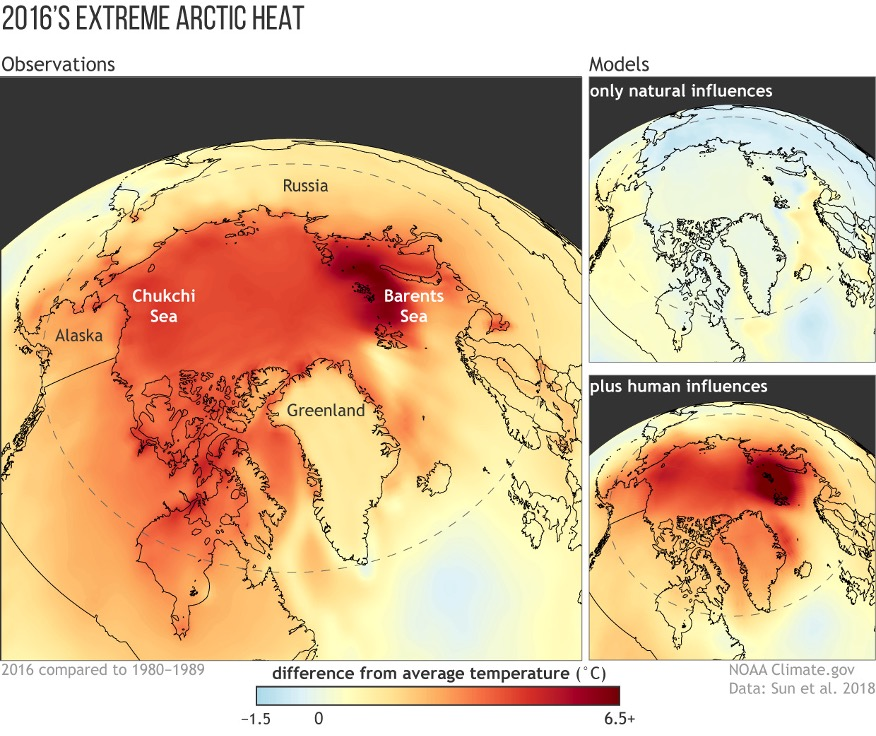




  


I have broad interests in climate research, including Arctic-lower latitude linkage, stratosphere-troposphere coupling, ocean-atmosphere interaction, and weather-climate interface. My work is supported by expertise in Earth System Modeling, particularly high-resolution modeling. Below are examples of my research areas.

  <!-- Left: Figure -->
  

    
  

  <!-- Right: Text -->
  

    <strong>Polar-amplification-Model-Intercomparison Project (PAMIP)</strong> 
    One of my primary research interests is the Arctic, specifically the impact of future sea ice loss on the global climate system. I have been deeply involved in the PAMIP, which aims to understand the causes and consequences of polar amplification. We have conducted various modeling experiments to address questions including,
   *  What caused the observed “Warm Arctic, Cold Continents” trend pattern in winter temperatures? What are the roles of sea ice concentration anomaly and ice thinning for the Arctic warming?
   *  What is the dynamical mechanism of future Arctic sea ice loss that influences the stratospheric and tropospheric circulation? How large is the stratospheric response to Arctic sea ice loss compared to its internal variability, and why does it matter? Is there any sensitivity to the stratospheric basic states? 
   *  How robust is the global coupled climate response to Arctic sea ice loss across different ice-constraining approaches? With ocean-atmosphere coupling, to what extent can Arctic sea ice loss influence Northern Hemisphere summertime storminess, and when might this impact become notable?

  

