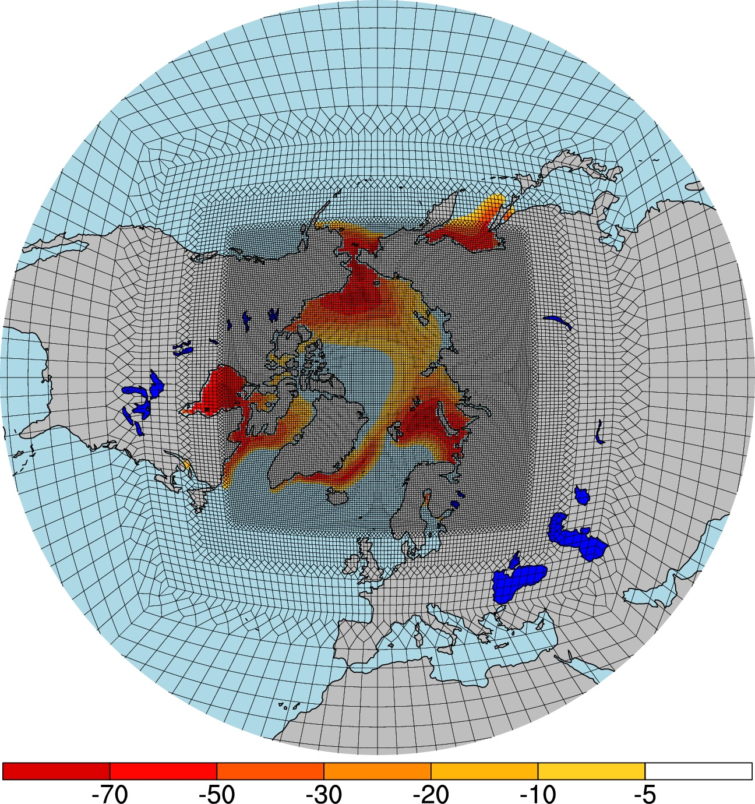
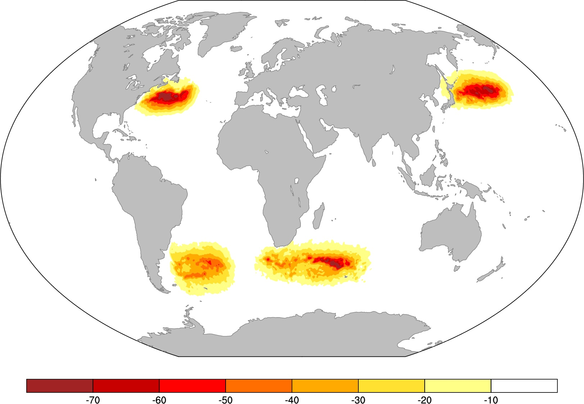
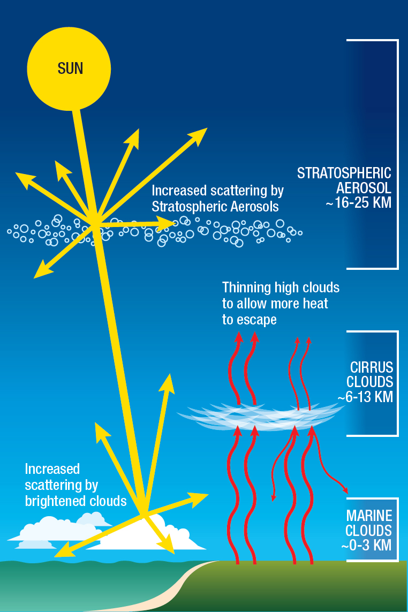
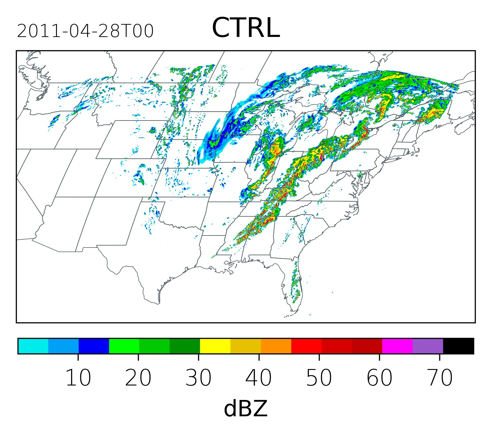
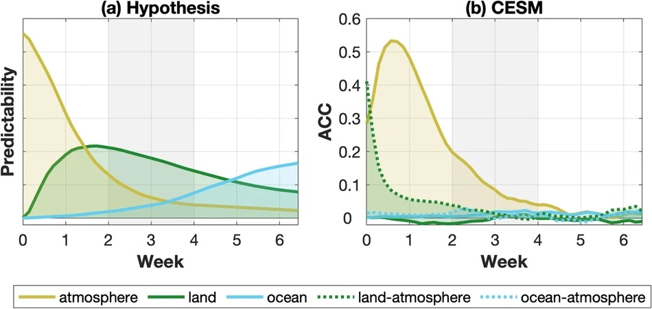
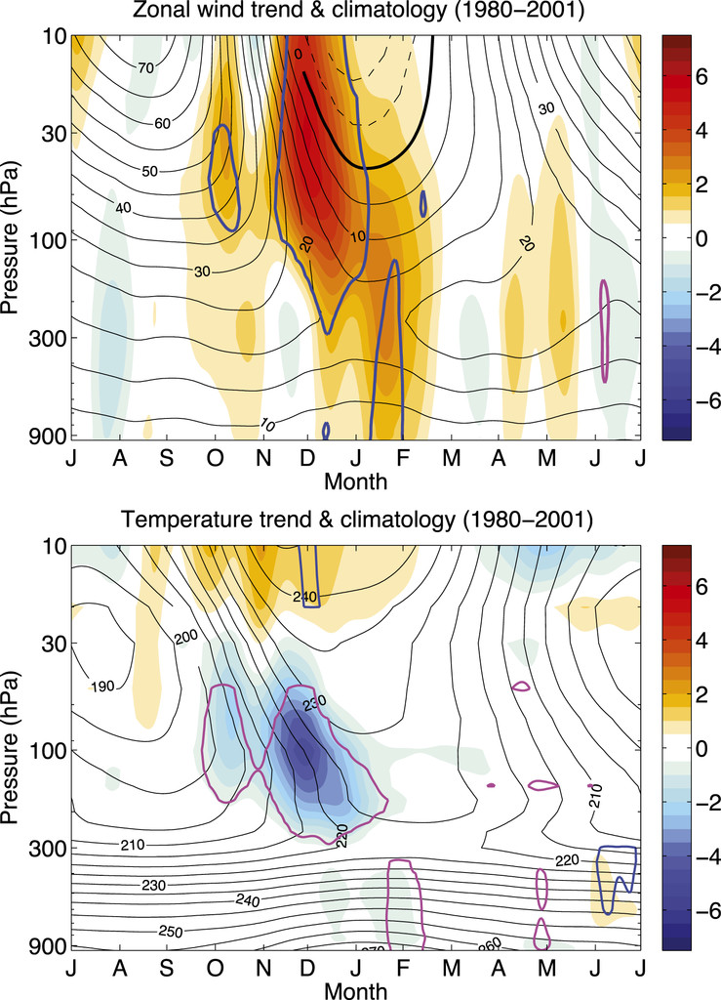




  


I have broad interests in climate research, including Arctic-lower latitude linkage, stratosphere-troposphere coupling, ocean-atmosphere interaction, and weather-climate interface. My work is supported by expertise in Earth System Modeling, particularly high-resolution modeling. Below are examples of my research areas.

  <!-- Left: Figure -->
  

      
  

  <!-- Right: Text -->
  

    <strong>1. Polar-amplification-Model-Intercomparison Project (PAMIP)</strong> 
    One of my primary research interests is the Arctic, specifically the impact of future sea ice loss on the global climate system. I have been deeply involved in the PAMIP, which aims to understand the causes and consequences of polar amplification. We have conducted various modeling experiments to address questions including:
    <ul>
      <li>What are the roles of sea ice concentration anomaly and ice thinning in driving the Arctic warming? What caused the observed “Warm Arctic, Cold Continents” trend pattern in winter temperatures? </li>
      <li>What is the dynamical mechanism of future Arctic sea ice loss that influences the stratospheric and tropospheric circulation? How large is the stratospheric response to Arctic sea ice loss compared to its internal variability, and why does it matter? Is there any sensitivity to the stratospheric basic states?</li>
      <li>How robust is the global coupled climate response to Arctic sea ice loss across different ice-constraining approaches? With ocean-atmosphere coupling, to what extent can Arctic sea ice loss influence Northern Hemisphere summertime storminess, and when might this impact become notable?</li>
    </ul>
  

  <!-- Left: Figure -->
  

      
  

  <!-- Right: Text -->
  

    <strong>2. High-resolution Modeling</strong> 
    My recent research theme involves utilizing high-resolution modeling to advance climate and weather research. I am part of the NSF supported Earthworks team, aiming to develop a 3.75-km global weather and climate model. I have been working on various projects utilizing the Arctic-refinement (⅛-deg) CESM as well as the International Laboratory for High-Resolution Earth System Prediction (iHESP) model at 0.1° ocean and 0.25° atmospheric resolution, exploring the sensitivity to model horizontal resolutions.
  

  <!-- Left: Figure -->
  

      
  

  <!-- Right: Text -->
  

    <strong>3. Western Boundary Current (WBC) air-sea interaction</strong> 
    WBCs, including the Gulf Stream, Kuroshio-Oyashio Extension, Brazil-Malvinas Confluence and Agulhas Currents, are midlatitude regions where ocean dynamics plays a key role in driving atmospheric variability. Previous studies have found that current-generation climate models are too coarse to capture small scales that are essential for accurately representing atmosphere-ocean coupling over WBCs. We are currently utilizing the slab-ocean coupled version of the iHESP model at 0.1° ocean and 0.25° atmospheric resolution to study the influence of ocean heat transport variability on atmospheric circulation. Our findings have important implications for large-scale atmospheric circulation. 
  

  <!-- Left: Figure -->
  

      
  

  <!-- Right: Text -->
  

    <strong>4. Solar Climate Intervention</strong> 
    Climate interventions are deliberate, large-scale actions aimed at mitigating global warming or offsetting its impacts. My research has focused on solar climate intervention (SCI) strategies, particularly stratospheric aerosol injection (SAI), which mimics the cooling effects of natural volcanic eruptions. I led a three-year NOAA grant to assess the impact of SCI on future U.S. severe convective storms using a 4-km convection-permitting Weather Research and Forecasting (WRF) model. We utilized the Pseudo-Global Warming (PGW) and analogous Pseudo-SAI (PSAI) approaches to explore changes in the frequency, intensity, and spatial distribution of convective storms under different climate change and SAI scenarios.
  

  <!-- Left: Figure -->
  

      
  

  <!-- Right: Text -->
  

    <strong>5. Weather-climate interface</strong> 
    The goal of this research is to explore how climate change and climate variability will impact extreme weather across the globe. Our group has been actively collaborating with Prof. Kristen Rasmussen at Colorado State University regarding this topic. 
  

  <!-- Left: Figure -->
  

      
  

  <!-- Right: Text -->
  

    <strong>6. Subseason-to-seasonal prediction</strong> 
    I have worked with colleagues at NOAA, NCAR and Colorado State University to assess the subseasonal predictive skill of the current-generation subseasonal forecast systems and explore the source of the predictability. 
  

  <!-- Left: Figure -->
  

      
  

  <!-- Right: Text -->
  

    <strong>7. Stratospehre-troposphere coupling</strong> 
    I have a background of stratospheric dynamics and  am still involved in various studies related to this topic. The questions we aim to address include: are there any tropospheric precursors to the sudden (final) stratospheric warming and strong polar vortex events? How are the stratospheric polar vortex variability and change impact the tropospheric circulation? 
  

